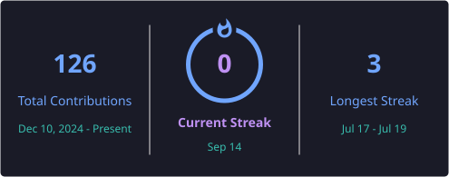

<!-- ==================== HEADER ==================== -->

  

  
  
  
  

 

<!-- ==================== ABOUT ==================== -->
## 👩‍💻 About Me

- 💜 Passionate about building scalable web applications and AI-powered solutions
- 🚀 Currently working on **AI-powered Full Stack projects**
- 🌱 Learning **Advanced React, Node.js, System Design & AI**
- 💻 Love creating projects that solve real-world problems
- 📚 Solving **Data Structures & Algorithms** in **Java**
- ⚡ Fun fact: coding is better with headphones 🎧 and good music

 

---

<!-- ==================== TECH STACK ==================== -->
## 🛠️ Tech Stack

  
  
  
  
  
  
  

  
  
  
  
  
  

  
  
  
  

---

<!-- ==================== PROJECTS ==================== -->
## 🚀 Featured Projects

- ✨ **[Voice Translator](https://github.com/Shivanishet/voice-translator)** — real-time voice translation across languages · [🔗 Live Demo](https://voice-translator-chi-silk.vercel.app/)
- ✨ **[Student Complaint System](https://github.com/Shivanishet/Student-complaint)** — a platform for managing and resolving student complaints · [🔗 Live Demo](https://student-complaint-ten.vercel.app/)
- ✨ **[AI Image Generator](https://github.com/Shivanishet/image-generator)** — generates images from text prompts using AI APIs · [🔗 Live Demo](https://image-generator-eight-omega.vercel.app/)

  

---

<!-- ==================== STREAK ==================== -->
## 🔥 GitHub Streak

---

<!-- ==================== QUOTE ==================== -->
## 💭 Quote I Live By

  

---

<!-- ==================== PROFILE VIEWS ==================== -->

  

